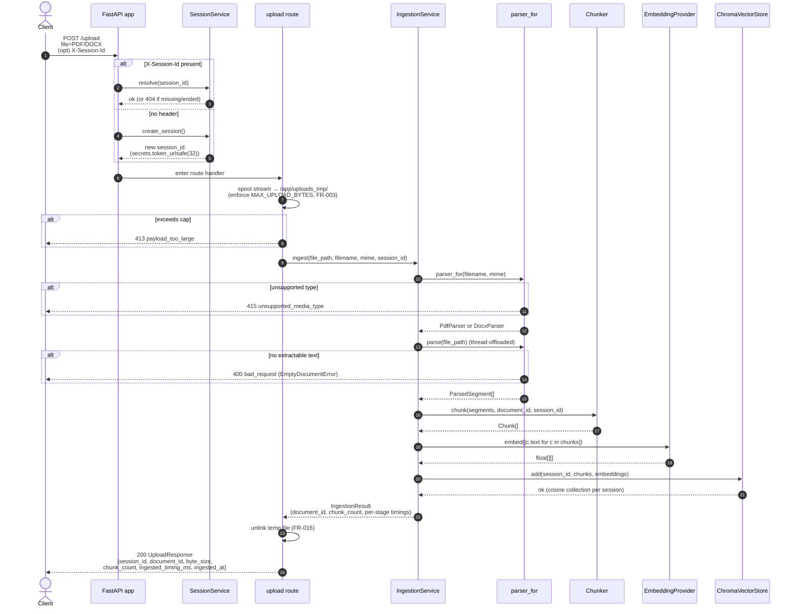
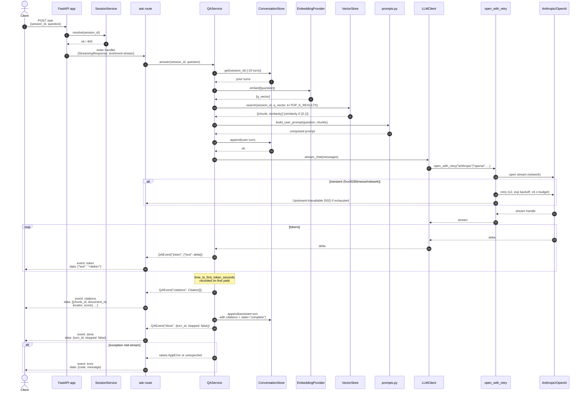
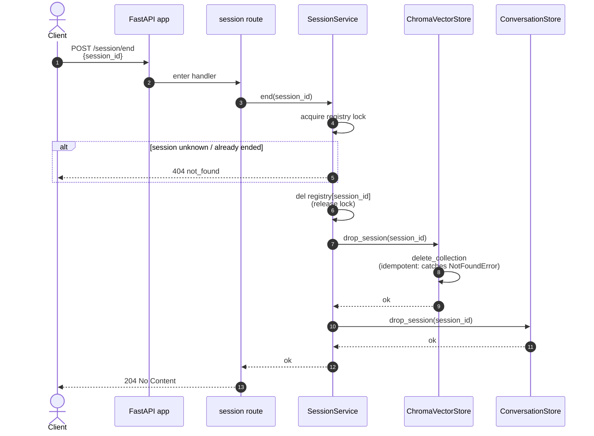
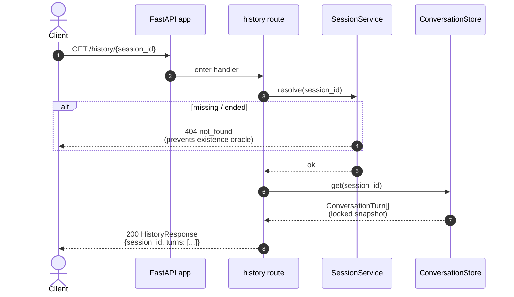

# Sequence Diagrams

Request-level flows for the four user-facing routes. Each diagram
matches a single HTTP call from the client; cross-layer hops are
annotated. Read alongside [architecture.md](./architecture.md) for the
system view and the [ADRs](../adr/README.md) for the why.

All diagrams use Mermaid.

---

## POST /upload — ingest a PDF or DOCX

Key invariants visible above:

- The temp file is deleted in a `finally`, regardless of whether
  ingestion succeeded.
- The session id is established before any storage write, so a failed
  ingest can never poison a different session.
- Provider-specific errors get mapped to typed `AppError` subclasses
  before reaching the wire — clients never see raw stack traces
  (FR-011).

---

## POST /ask — streamed Q&A

Key invariants:

- `event: token` payload is **always** `{"text": delta}` (object), never
  a bare string. The OpenAPI spec enforces this; the SPA expects it.
- `event: citations` is emitted **exactly once**, **before** `done`.
- The user turn is persisted to history **before** the LLM stream starts
  so a concurrent `/history/{sid}` returns a coherent transcript.
- Retry is scoped to the connection-open ([ADR 0006](../adr/0006-sse-streaming-approach.md)).
  Once tokens start flowing, errors propagate to the `error` SSE frame
  rather than retrying (we can't replay a token stream).

---

## POST /session/end — purge a session

Idempotency story: the registry entry is removed first, so a concurrent
`/ask` or `/upload` referencing this handle will see a `NotFoundError`
during `resolve` before reaching the store layers. The vector store and
history store calls are themselves idempotent (vector store catches
`chromadb.errors.NotFoundError`; history store pops with a default), so
a half-completed `end` can be retried safely.

---

## GET /history/{session_id} — fetch transcript

No global auth gate in this single-tenant demo — anyone holding the
opaque `session_id` can read the transcript. This matches the v1
posture: a single internal user on a trusted laptop. Production
deploys MUST front the API with a reverse proxy / API gateway that
enforces authentication. Per-user accounts and per-session ACLs are
deferred (see Q1 / Q2 clarifications in the spec).

---

## Related

- [architecture.md](./architecture.md) — system-level view.
- [../adr/](../adr/README.md) — design decisions.
- [../how-to/quickstart.md](../how-to/quickstart.md) — run it locally.
- [`contracts/openapi.yaml`](../../specs/001-doc-assistant-rag/contracts/openapi.yaml) — wire contract.
